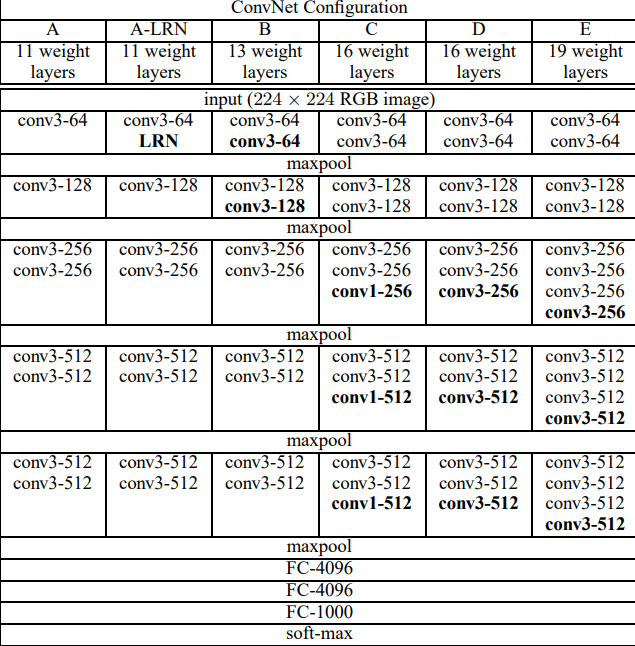

# Very-deep-convolutional-networks-for-large-scale-image-recognition-Implementation
This repository contains a PyTorch implementation of the VGGNet architecture as described in the paper "Very Deep Convolutional Networks for Large-Scale Image Recognition" by Karen Simonyan and Andrew Zisserman.
- Citation- Simonyan, K., & Zisserman, A. (2015). Very deep convolutional networks for large-scale image recognition. 3rd International Conference on Learning Representations (ICLR 2015), 1–14.

### Training
1. Download and extract dataset as mentioned in [dataset](https://github.com/Attila94/CODaN)
2. run
```python
pip install -r requirements.txt
```
4. Directory structure will be as follows-
```bash
root
|-- model.py
|-- train.py
|-- codan
    |-- data
        |-- train
        |-- val
```
5. run
```python
python train.py
```


**NOTES**

1. Input is a fixed-size 224 × 224 RGB image
2. Only preprocessing is subtracting the mean RGB value, computed on the training set, from each pixel
3. Convolution is performed over a 3 × 3 kernal, with stride 1.
4. Max-pooling is performed over a 2 × 2 pixel window, with stride 2.
5. The stack of convolutional layers is followed by **three** Fully-Connected (FC) layers: the first two have 4096 channels each, the third performs 10- way ILSVRC classification and thus contains 10 channels (one for each class).
6. Training -
	a) mini-batch gradient descent (based on back-propagation (LeCun et al., 1989)) with momentum.
		batch size was set to 256, momentum to 0.9
	b) regularised by weight decay (the L2 penalty multiplier set to 5 · 10−4 ) and dropout regularisation
		for the first two fully-connected layers (dropout ratio set to 0.5).
	c) The learning rate was initially set to 10−2 , and then decreased by a factor of 10 when the validation set accuracy stopped improving.
	d) 74 epochs
	c) `model A` is shallow enough to be trained with random initialisation.
	e) For random initialisation (where applicable), we sampled the weights from a normal distribution
		with the zero mean and 10−2 variance. The biases were initialised with zero.
	f) We will use simpler [dataset](https://github.com/Attila94/CODaN) with less number of classes as we are training on CPU.
7. They have suggested different method for testing which allows us to test model on images with different sizes using class score maps, let us keep this aside for `phase 2`. We will test them with images of same size as training images.

### Model Architecture




